<!-- _class: lead -->

# Unidad 1
## Estructura de las redes de datos

**RA1:** Reconocer los elementos y principios de funcionamiento de las redes de datos.

---

# Objetivos de la unidad

Al finalizar podrás:

- Distinguir los tipos y las topologías de red.
- Explicar cómo viaja la información por una red.
- Relacionar dispositivos, protocolos y capas OSI.
- Elegir medios de transmisión y cableado adecuados.

---

# Pregunta inicial

> Cuando abres una página web desde tu móvil, ¿qué elementos intervienen para que la información llegue desde el servidor hasta ti?

Piensa en dispositivos, cables o Wi-Fi, direcciones y reglas de comunicación.

---

# 1. ¿Por qué crecen las redes?

- Cada vez producimos y compartimos más datos.
- Necesitamos recursos comunes: Internet, impresoras, archivos y aplicaciones.
- El teletrabajo y la movilidad conectan personas y sedes distantes.
- Fibra, Wi-Fi y 5G aportan más velocidad y disponibilidad.
- Los estándares permiten que tecnologías y fabricantes distintos colaboren.

---

# 2. Sistemas de numeración

Los dispositivos trabajan con **bits**: `0` y `1`.

| Sistema | Base | Símbolos | Uso habitual |
|---|---:|---|---|
| Decimal | 10 | 0-9 | Personas, IPv4 |
| Binario | 2 | 0, 1 | Funcionamiento interno |
| Hexadecimal | 16 | 0-9, A-F | MAC e IPv6 |

---

# Bit, byte y octeto

- Un **bit** es la unidad mínima: `0` o `1`.
- Un **byte** u **octeto** contiene **8 bits**.
- Una dirección IPv4 tiene **32 bits**: cuatro octetos.

```text
192 . 168 . 1 . 1
  8     8    8   8 bits
```

---

# Conversión: decimal y binario

Para convertir decimal a binario, divide entre 2 y lee los restos de abajo arriba.

```text
156 / 2 = 78  resto 0
 78 / 2 = 39  resto 0
 39 / 2 = 19  resto 1
 ...

156(10) = 10011100(2)
```

---

# Conversión: binario y hexadecimal

Cada cifra hexadecimal representa exactamente **4 bits**.

```text
1001 1100  =  9 C
```

| Hex | Binario | Hex | Binario |
|---|---|---|---|
| A | 1010 | C | 1100 |
| B | 1011 | F | 1111 |

---

# Ejemplo aplicado

La misma información puede representarse de varias formas:

```text
156(10) = 10011100(2) = 9C(16)
```

- **IPv4:** `192.168.1.1` (decimal).
- **MAC:** `00:1A:2B:3C:4D:5E` (hexadecimal).

---

# 3. Tipos de red por alcance

- **PAN:** alrededor de una persona. Ej.: móvil y auriculares Bluetooth.
- **LAN:** área local. Ej.: aula, oficina o instituto.
- **CAN:** varios edificios cercanos, como un campus.
- **MAN:** una ciudad.
- **WAN:** grandes distancias. Ej.: Internet.

---

<!-- _class: lead -->

# Redes según su extensión


---

# 4. Topología de red

La **topología** es la forma en que se conectan los equipos y circula la información.

Las más importantes:

- Bus
- Anillo
- Estrella
- Árbol
- Malla
- Híbrida

---

# Topología en bus

- Todos los equipos comparten un cable central.
- Es sencilla y requiere poco cableado.
- Si falla el cable troncal, falla toda la red.
- En un medio compartido pueden producirse colisiones.


---

# Topología en anillo

- Los equipos forman un circuito cerrado.
- La información pasa de un nodo al siguiente.
- Puede usar paso de testigo para evitar colisiones.
- Un fallo puede afectar a toda la comunicación.


---

# Topología en estrella

- Cada equipo tiene su propio enlace con un nodo central.
- Es fácil de ampliar y administrar.
- El fallo de un cable afecta a un solo equipo.
- Si falla el **switch** central, se interrumpe la red.


---

# Topologías en árbol y malla

| Árbol | Malla |
|---|---|
| Estrellas organizadas jerárquicamente. | Nodos conectados mediante varios caminos. |
| Escalable. | Muy tolerante a fallos. |
| Depende de los nodos superiores. | Más costosa y compleja. |

---

<!-- _class: lead -->

# Topología en árbol


---

<!-- _class: lead -->

# Topología en malla


---

# 5. Medios de transmisión

Los datos necesitan un medio físico para viajar.

| Guiados (cable) | No guiados (inalámbricos) |
|---|---|
| Par trenzado | Wi-Fi y Bluetooth |
| Coaxial | Radio y microondas |
| Fibra óptica | Satélite |

---

# Cobre frente a fibra

| Par trenzado | Fibra óptica |
|---|---|
| Económico y fácil de instalar. | Muy alta velocidad y largo alcance. |
| Habitual en LAN, hasta 100 m. | Inmune a interferencias. |
| Puede sufrir interferencias. | Más cara y delicada de instalar. |

---

# 6. Arquitectura en capas

Una arquitectura de red organiza la comunicación en **capas**.

- Cada capa realiza una función concreta.
- Ofrece servicios a la capa superior.
- Usa los servicios de la capa inferior.
- Facilita el mantenimiento y la interoperabilidad.

Los modelos principales son **OSI** y **TCP/IP**.

---

# 7. Encapsulamiento

Al enviar datos, cada capa añade información de control:

```text
Datos -> Segmento -> Paquete -> Trama -> Bits
```

En el receptor sucede lo contrario: **desencapsulamiento**.

---

<!-- _class: lead -->

# Encapsulamiento paso a paso


---

# 8. Modelo OSI

OSI es un modelo de referencia de **7 capas**.

| Capas superiores | Capa de transporte | Capas inferiores |
|---|---|---|
| Aplicación | Transporte | Red |
| Presentación |  | Enlace |
| Sesión |  | Física |

---

<!-- _class: lead -->

# Las siete capas OSI


---

# Capas OSI: idea clave

| Capa | Pregunta que responde |
|---|---|
| Aplicación | ¿Qué servicio usa el usuario? |
| Transporte | ¿Llega completo y al proceso correcto? |
| Red | ¿Por qué ruta viaja entre redes? |
| Enlace | ¿A qué equipo local se entrega? |
| Física | ¿Cómo se transmiten los bits? |

---

# 9. Modelo TCP/IP

TCP/IP es la arquitectura práctica utilizada en Internet.

| TCP/IP | Agrupa capas OSI | Ejemplos |
|---|---|---|
| Aplicación | 5, 6 y 7 | HTTP, DNS, SMTP |
| Transporte | 4 | TCP, UDP |
| Internet | 3 | IP, ICMP |
| Acceso a red | 1 y 2 | Ethernet, Wi-Fi |

---

<!-- _class: lead -->

# OSI y TCP/IP


---

# 10. Protocolos

Un **protocolo** es un conjunto de reglas para comunicarse.

Define:

- El formato de los mensajes.
- El significado de los datos.
- El orden y el momento de los intercambios.

> Si emisor y receptor no comparten protocolo, no pueden entenderse.

---

# Ejemplo: visitar una web

Una petición a una página web usa una **pila de protocolos**:

```text
HTTP  -> solicita la página
TCP   -> entrega fiable
IP    -> busca el destino entre redes
Ethernet / Wi-Fi -> transmite en la red local
```

Cada protocolo cumple una función distinta.

---

# 11. Elementos de una red

| Físicos | Lógicos | Funcionales |
|---|---|---|
| PCs, servidores, NIC, switch, cables | SO, IP, MAC, DNS, DHCP | Cliente, servidor, emisor, receptor |

Todos son necesarios para que la red preste servicios.

---

<!-- _class: lead -->

# Elementos físicos de una LAN


---

# 12. Ethernet

**Ethernet (IEEE 802.3)** es la tecnología LAN más extendida.

- Opera en las capas **Física** y **Enlace**.
- Usa direcciones **MAC** de 48 bits.
- Transporta datos mediante **tramas Ethernet**.
- En redes actuales con switch full-duplex no hay colisiones.

---

# Velocidades Ethernet

| Tecnología | Velocidad |
|---|---:|
| Ethernet | 10 Mbps |
| Fast Ethernet | 100 Mbps |
| Gigabit Ethernet | 1 Gbps |
| 10 Gigabit Ethernet | 10 Gbps |
| 40/100 Gigabit Ethernet | 40-100 Gbps |

---

# Cableado Ethernet

La denominación combina velocidad, señal y medio:

| Estándar | Medio | Distancia máxima |
|---|---|---:|
| 1000BASE-T | Par trenzado Cat5e/6 | 100 m |
| 10GBASE-T | Par trenzado Cat6a/7 | 100 m |
| 1000BASE-SX | Fibra multimodo | ~550 m |
| 1000BASE-LX | Fibra monomodo | ~5 km |

---

# Conector RJ-45 y cableado

- El conector habitual del par trenzado es **RJ-45 (8P8C)**.
- **T568A** y **T568B** determinan el orden de los hilos.
- Un cable directo usa el mismo estándar en ambos extremos.
- Un cable cruzado usa A en un extremo y B en el otro.

Los equipos modernos suelen admitir **Auto-MDIX**.

---

# 13. Fibra óptica

La fibra transmite datos mediante **pulsos de luz**.

- **Núcleo:** por él viaja la luz.
- **Revestimiento:** mantiene la luz dentro del núcleo.
- **Cubierta:** protege el cable.

---

# Fibra multimodo y monomodo

| Multimodo (MMF) | Monomodo (SMF) |
|---|---|
| Varios rayos de luz. | Un único modo de luz. |
| Menor distancia y coste. | Mucha mayor distancia. |
| LAN y campus. | Troncales y WAN. |

Conectores habituales: **SC**, **LC**, **ST** y **FC**.

---

# 14. Dispositivos de interconexión

| Dispositivo | Capa OSI | Función principal |
|---|---:|---|
| Repetidor / Hub | 1 | Regenera o replica la señal |
| Switch | 2 | Conmuta según MAC |
| Router | 3 | Encaminamiento según IP |
| Gateway | Hasta 7 | Traduce protocolos |

---

<!-- _class: lead -->

# Dispositivos y capas OSI


---

# Punto de acceso (AP)

Un **AP** integra dispositivos Wi-Fi en una red cableada.

- Opera principalmente en las capas 1 y 2.
- Conecta el medio inalámbrico con Ethernet.
- Se enlaza habitualmente por cable a un switch.
- Los clientes Wi-Fi comparten el canal radioeléctrico.

---

<!-- _class: lead -->

# Punto de acceso en una LAN

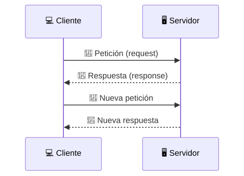

---

# Dominios de red

- **Dominio de colisión:** equipos que comparten un medio y pueden interferirse.
  - Un hub: un único dominio.
  - Un switch: un dominio por puerto.

- **Dominio de difusión:** equipos que reciben mensajes broadcast.
  - Un router separa dominios de difusión.

---

# 15. Modelo cliente-servidor

- El **servidor** ofrece un servicio y espera peticiones.
- El **cliente** solicita ese servicio y recibe la respuesta.

Ejemplos:

- Navegador web -> servidor web.
- Cliente de correo -> servidor de correo.
- Cliente FTP -> servidor de archivos.

---

# Cliente-servidor frente a P2P

| Cliente-servidor | P2P |
|---|---|
| Roles diferenciados. | Todos los equipos pueden ofrecer y pedir recursos. |
| Gestión centralizada. | Gestión distribuida. |
| Ej.: web, correo, bases de datos. | Ej.: intercambio entre iguales. |

---

# 16. Organismos de estandarización

| Organismo | Aportación |
|---|---|
| ISO | Modelo de referencia OSI |
| IEEE | Ethernet (802.3) y Wi-Fi (802.11) |
| IETF | Estándares de Internet: TCP/IP, DNS, HTTP |
| TIA/EIA | Cableado estructurado |

Los estándares hacen posible la interoperabilidad.

---

# Actividad final

En parejas, diseña la red de un aula con:

- 15 ordenadores.
- Una impresora de red.
- Acceso Wi-Fi.
- Conexión a Internet.

Indica qué topología, dispositivos, medio de transmisión y protocolos usarías.

---

<!-- _class: lead -->

# Ideas clave

- Las redes conectan dispositivos mediante medios y protocolos.
- OSI y TCP/IP organizan la comunicación por capas.
- Ethernet, IP y TCP trabajan conjuntamente en la pila de protocolos.
- Switches, routers y AP tienen funciones y capas distintas.
- Los estándares permiten que todo funcione de forma compatible.
