# Unidad 1 – Estructura de las redes de datos <!-- omit from toc -->

**Módulo:** Planificación y Administración de Redes

**RA1:** Reconoce la estructura de las redes de datos identificando sus elementos y principios de funcionamiento.

---

## 1. Evolución y expansión de las redes de datos

*(CE-a: factores que impulsan la continua expansión y evolución de las redes de datos)*

Las redes de datos permiten la comunicación entre dispositivos para compartir información y recursos. Su crecimiento y evolución constante se debe a varios factores:

- **Aumento del volumen de información**: cada vez se genera, almacena y transmite más cantidad de datos (documentos, vídeo, voz, IoT, big data).
- **Necesidad de compartir recursos**: impresoras, almacenamiento, aplicaciones y conexión a Internet compartidos entre varios usuarios.
- **Globalización y teletrabajo**: necesidad de comunicación entre sedes distantes, oficinas remotas y trabajadores en movilidad.
- **Avances tecnológicos**: mejora de los medios de transmisión (fibra óptica, 5G), mayor velocidad y ancho de banda, reducción de costes del hardware de red.
- **Nuevos servicios y aplicaciones**: streaming, videoconferencia, redes sociales, cloud computing, IoT (Internet de las Cosas).
- **Convergencia de servicios**: voz, datos y vídeo circulando por una misma infraestructura (VoIP, IPTV).
- **Movilidad**: dispositivos móviles, redes inalámbricas (Wi-Fi, 4G/5G) que exigen conectividad permanente.
- **Seguridad y fiabilidad**: necesidad de redes más robustas, redundantes y seguras ante el aumento de ciberamenazas.
- **Estandarización**: la existencia de normas y protocolos comunes (TCP/IP, Ethernet) facilita la interconexión entre fabricantes y tecnologías distintas, impulsando su expansión.

---

## 2. Sistemas de numeración: decimal, binario y hexadecimal

*(CE-g Se han presentado y descrito los elementos funcionales, físicos y lógicos, de las redes de datos.)*

Las redes de datos trabajan internamente con información binaria. Para interpretar direcciones IP, máscaras de red o direcciones MAC es necesario dominar la conversión entre sistemas.

### 2.1 Sistema decimal (base 10)

Utiliza 10 dígitos: 0-9. Es el sistema habitual de uso humano.

**Ejemplo con parte decimal:** `12,625₁₀`. La coma separa la parte entera (`12`) de la parte fraccionaria (`625`).

### 2.2 Sistema binario (base 2)

Utiliza 2 dígitos: 0 y 1. Cada dígito es un **bit**. Un grupo de 8 bits es un **byte** (octeto), unidad básica usada en direcciones IPv4.

**Ejemplo con parte fraccionaria:** `1100,101₂`. Su valor es:

```text
1·2³ + 1·2² + 0·2¹ + 0·2⁰ + 1·2⁻¹ + 0·2⁻² + 1·2⁻³
= 8 + 4 + 0 + 0 + 0,5 + 0 + 0,125 = 12,625₁₀
```

### 2.3 Sistema hexadecimal (base 16)

Utiliza 16 símbolos: 0-9 y A-F (donde A=10, B=11, C=12, D=13, E=14, F=15). Se usa habitualmente para representar direcciones MAC e IPv6.

**Ejemplo con parte fraccionaria:** `C,A₁₆`. Su valor es:

```text
C·16⁰ + A·16⁻¹ = 12 + 10/16 = 12,625₁₀
```

Por tanto, el mismo valor puede escribirse como **12,625₁₀ = 1100,101₂ = C,A₁₆**.

### 2.4 Conversión entre sistemas

**Decimal → Binario**: divisiones sucesivas entre 2, tomando los restos de abajo hacia arriba.

Ejemplo: 156 → 10011100
```
156 / 2 = 78  resto 0
78  / 2 = 39  resto 0
39  / 2 = 19  resto 1
19  / 2 = 9   resto 1
9   / 2 = 4   resto 1
4   / 2 = 2   resto 0
2   / 2 = 1   resto 0
1   / 2 = 0   resto 1
```
Leyendo los restos de abajo a arriba: **10011100**

Ejemplo con parte fraccionaria: 12.625 → 1100,101
```
Parte entera: 12 / 2 = 6 r0
6 / 2 = 3 r0
3 / 2 = 1 r1
1 / 2 = 0 r1
Lectura restos: 1100

Parte fraccionaria: 
0,625 * 2 = 1,25 -> bit 1
0.25 * 2 = 0,5   -> bit 0
0.5 * 2 = 1,0    -> bit 1
Lectura bits fraccionarios en orden: 101
Resultado combinado: 1100,101
```

**Binario → Decimal**: se multiplica cada bit por 2 elevado a la posición (empezando en 0 por la derecha) y se suman.

Ejemplo: 10011100
```
1·2⁷ + 0·2⁶ + 0·2⁵ + 1·2⁴ + 1·2³ + 1·2² + 0·2¹ + 0·2⁰
= 128 + 0 + 0 + 16 + 8 + 4 + 0 + 0 = 156
```

Ejemplo con parte fraccionaria: 1100,101
```
1·2³ + 1·2² + 0·2¹ + 0·2⁰ + 1·2⁻¹ + 0·2⁻² + 1·2⁻³
= 8 + 4 + 0 + 0 + 0,5 + 0 + 0,125 = 12,625
```

**Decimal → Hexadecimal**: divisiones sucesivas entre 16.

Ejemplo: 156 → 9C
```
156 / 16 = 9  resto 12 (C)
9   / 16 = 0  resto 9
```
Resultado: **9C**

Ejemplo con parte fraccionaria: 12,625 → C,A
```
Parte entera: 12 / 16 = 0 resto 12 -> C

Parte fraccionaria: 0,625 * 16 = 10,0 -> A (10)
Lectura: C,A
```

**Hexadecimal → Decimal**: multiplicar cada símbolo por 16 elevado a su posición.

Ejemplo: 9C = 9·16¹ + 12·16⁰ = 144 + 12 = 156

Ejemplo con parte fraccionaria: C,A
```
C·16⁰ + A·16⁻¹ = 12 + 10/16 = 12 + 0,625 = 12,625
```

**Binario ↔ Hexadecimal**: cada dígito hexadecimal equivale exactamente a 4 bits (nibble), por lo que la conversión es directa agrupando de 4 en 4.

| Hex | Binario |
|-----|---------|
| 0   | 0000 |
| 1   | 0001 |
| 2   | 0010 |
| 3   | 0011 |
| 4   | 0100 |
| 5   | 0101 |
| 6   | 0110 |
| 7   | 0111 |
| 8   | 1000 |
| 9   | 1001 |
| A   | 1010 |
| B   | 1011 |
| C   | 1100 |
| D   | 1101 |
| E   | 1110 |
| F   | 1111 |

Ejemplo: 10011100 → 1001 1100 → 9C

Ejemplo con parte fraccionaria: 1100,101 → 1100 , 1010 → C,A
```
Parte entera: 1100 -> 1100 = C
Parte fraccionaria: 101 -> agrupar de 4 hacia la derecha: 1010 (añadimos un 0 a la derecha) = A
Resultado: 1100,101₂ = C,A₁₆
```

**Explicación:** para convertir binario fraccionario a hexadecimal, agrupa los bits en bloques de 4 empezando desde el punto decimal: 
- a la izquierda (parte entera) agrupa hacia la derecha y, si falta, añade ceros a la izquierda del bloque menos significativo; 
- a la derecha (parte fraccionaria) agrupa hacia la izquierda y añade ceros a la derecha si hace falta para completar 4 bits. Convierte cada nibble a su dígito hexadecimal correspondiente.


> **Aplicación práctica**: una dirección IPv4 (32 bits) se representa en 4 octetos decimales separados por puntos (ej. 192.168.1.1), mientras que una dirección MAC (48 bits) se representa en hexadecimal separada por dos puntos o guiones (ej. 00:1A:2B:3C:4D:5E).

---

## 3. Transmisión de Datos

*(CE-b Se han diferenciado los distintos medios de transmisión utilizados en las redes)*

### 3.1 El bit

El **bit** (binary digit) es la unidad mínima de información en los sistemas digitales. Puede tomar dos valores: 0 o 1. Los ordenadores almacenan y transmiten los datos internamente como secuencias de bits que, agrupados en bytes (8 bits) y palabras, representan números, caracteres, instrucciones y cualquier otro tipo de información.

Cómo se almacenan y transmiten:
- **Almacenamiento:** físicamente los bits se representan por diferentes estados eléctricos, magnéticos u ópticos según la tecnología (ej.: voltaje alto/bajo en memoria RAM o discos SSD, polarización magnética en discos duros, presencia/ausencia de luz en fibra). Estos estados se organizan en celdas o circuitos y se leen/escriben por el controlador del dispositivo.

- **Transmisión:** en enlaces eléctricos (par trenzado, coaxial) un bit se codifica como una variación de voltaje o corriente; en fibra óptica, como pulsos de luz; en inalámbricos, como variaciones de amplitud/frecuencia/fase de la portadora. Para mejorar la fiabilidad se usan codificaciones y señales de sincronización, así como técnicas de detección y corrección de errores.

Dispositivos de entrada y salida — qué hacen:
- Dispositivos de entrada (teclado, ratón, micrófono, sensores): convierten acciones físicas o señales del mundo real en datos binarios que el ordenador puede procesar (ej.: una tecla pulsada → código de carácter → secuencia de bits enviada al sistema operativo).
- Dispositivos de salida (pantalla, altavoz, impresora, actuadores): reciben datos binarios y los traducen a señales perceptibles por el usuario o por el entorno (ej.: secuencia de píxeles en la GPU → señales eléctricas → luz en la pantalla; datos de audio → DAC → vibración en altavoz).

Almacenamiento dentro del ordenador:
- En el interior del equipo, todo se guarda en formatos binarios: archivos, programas, tablas y estructuras de datos. Los sistemas de archivos organizan los bytes en bloques y sectores; la memoria principal gestiona celdas direccionables por la CPU.

Ejemplo de código normalizado (ejemplo ilustrativo `u8tf`):
- Supongamos un esquema de codificación llamado `u8tf` que define un tipo de dato de 8 bits sin signo (u8) seguido de una etiqueta de formato `tf`. Un valor decimal 13 se almacenaría como `00001101` en binario y, usando la notación `u8tf(13)`, quedaría normalizado como `u8tf:00001101` para su transmisión o registro.

En la práctica se usan estándares como ASCII/UTF-8 para texto y formatos bien definidos para datos binarios en protocolos y APIs.

### 3.2 Métodos de transmisión de datos

Una vez transformados los datos a una serie de bits, en las redes se emplean tres métodos principales para transmitir esas señales:

- **Señales eléctricas:** se usan en medios guiados como el par trenzado y el coaxial. Un bit se representa mediante variaciones de voltaje o corriente (por ejemplo, nivel alto = 1, nivel bajo = 0) o mediante esquemas más complejos de codificación (Manchester, NRZ, PAM). 
  - Ventajas: coste bajo y facilidad de uso en entornos LAN; 
  - inconvenientes: susceptibilidad a ruido e interferencias, y atenuación en largas distancias.

- **Señales ópticas:** se usan en fibra óptica, donde los bits se codifican como pulsos de luz (presencia/ausencia de pulso o modulaciones de intensidad/fase/frecuencia). 
  - Ventajas: gran ancho de banda, baja atenuación y resistencia a interferencias electromagnéticas; 
  - inconvenientes: mayor coste y necesidad de conversión óptico-eléctrica en extremos.

- **Señales inalámbricas (radiofrecuencia/microondas):** los bits se transmiten modulando una portadora en parámetros como amplitud, frecuencia o fase (ASK, FSK, PSK, QAM). Se usan en Wi‑Fi, LTE/5G, enlaces punto a punto y satélites. 
  - Ventajas: movilidad y despliegue sin cableado; 
  - inconvenientes: mayor vulnerabilidad a la interferencia, pérdida por obstáculos y limitación de espectro/regulación.

Ejemplo práctico: transmitir el byte `01001101` (ASCII 'M')
- Por cable UTP (eléctrico): el transmisor genera una serie de voltajes sincronizados que representan cada bit y el receptor reconstrute la secuencia a través del voltaje medido en cada intervalo de bit.
- Por fibra (óptico): el transmisor usa un láser/LED para emitir pulsos de luz en los intervalos correspondientes a los '1' y silencio para los '0'; el fotodetector del receptor convierte de nuevo la luz en señales eléctricas.
- Por Wi‑Fi (inalámbrico): los mismos bits se modulaban sobre una portadora RF usando, por ejemplo, QPSK/QAM; la tarjeta inalámbrica del receptor demodula la portadora y recupera la secuencia de bits.

En todos los casos, para evitar errores se aplican capas de enlace y transporte que añaden sincronización, codificación de línea, detección y corrección de errores, y protocolos que permiten reenviar paquetes dañados.

### 3.3 Ancho de banda

El **ancho de banda** es la capacidad máxima de un canal de comunicación para transmitir información en un periodo de tiempo, normalmente expresada en bits por segundo. No debe confundirse con la latencia (retardo): ancho de banda indica cuánto se puede transferir por segundo; latencia indica cuánto tarda en empezar a llegar.

Medidas comunes de ancho de banda — unidad, abreviatura y equivalencia:

| Unidad | Abreviatura | Equivalencia |
|---:|:---:|:---:|
| bit por segundo | bps | 1 bps = 1 bit/s |
| kilobit por segundo | kbps | 1 kbps = 10³ bps = 1 000 bps |
| megabit por segundo | Mbps | 1 Mbps = 10⁶ bps = 1 000 kbps |
| gigabit por segundo | Gbps | 1 Gbps = 10⁹ bps = 1 000 Mbps |
| terabit por segundo | Tbps | 1 Tbps = 10¹² bps = 1 000 Gbps |

>Nota: en redes suele usarse la notación decimal (k=10³, M=10⁶), mientras que en almacenamiento a veces aparecen prefijos binarios (KiB, MiB) donde 1 KiB = 2¹⁰ bytes. En la práctica, las velocidades de enlace (ej. 100 Mbps, 1 Gbps) se refieren a la tasa de bits por segundo disponible para transmitir datos.

---

## 4. Medios de transmisión

*(CE-b: Se han diferenciado los distintos medios de transmisión utilizados en las redes.)*

Los medios de transmisión son el soporte físico por el que viaja la información. Se dividen en:

### 4.1 Medios guiados (cableados)

- **Cable de par trenzado (UTP/STP)**: pares de hilos de cobre trenzados para reducir interferencias. UTP (sin apantallar) y STP (apantallado). Es el más usado en redes LAN Ethernet. Categorías (Cat5e, Cat6, Cat6a, Cat7...) que determinan la velocidad y el ancho de banda soportado.

  

  *Cable UTP Cat. 6 (sin apantallar). Fuente: Wikimedia Commons (Talifero, CC).*

  

  *Cable de par trenzado apantallado (FTP), con la lámina metálica visible que protege frente a interferencias. Fuente: Wikimedia Commons (Baran Ivo, CC).*

- **Cable coaxial**: un conductor central de cobre rodeado de aislante, malla metálica y cubierta exterior. Usado antiguamente en Ethernet (10BASE2/10BASE5) y en redes de televisión por cable.

  

  *Corte transversal de un cable coaxial: se aprecian el conductor central, el aislante, la malla metálica y la cubierta exterior. Fuente: Wikimedia Commons (FDominec, CC).*

- **Fibra óptica**: transmite luz en lugar de señales eléctricas. Máxima velocidad, ancho de banda e inmunidad a interferencias electromagnéticas. Mayor alcance y coste. *(Ver fotos y detalle de conectores en el apartado 16 de este documento.)*

### 4.2 Medios no guiados (inalámbricos)

- **Ondas de radiofrecuencia**: Wi-Fi, Bluetooth.
- **Microondas**: enlaces punto a punto (terrestres o vía satélite).
- **Infrarrojos**: comunicación de corto alcance y línea de visión directa (mandos a distancia, algunos dispositivos antiguos).

### Comparativa

| Medio | Velocidad | Alcance | Coste | Inmunidad a interferencias |
|---|---|---|---|---|
| Par trenzado | Media-Alta | Corto (~100 m) | Bajo | Baja/Media |
| Coaxial | Media | Medio | Medio | Media |
| Fibra óptica | Muy alta | Largo (km) | Alto | Muy alta |
| Inalámbrico | Variable | Variable | Bajo-Medio | Baja |

---

## 5. Elementos funcionales, físicos y lógicos de una red

*(CE-g Se han presentado y descrito los elementos funcionales, físicos y lógicos, de las redes de datos.)*

### Elementos físicos (hardware)

- **Terminales/hosts**: ordenadores, portátiles, móviles, servidores, impresoras de red.
- **Dispositivos de interconexión**: hub, switch, router, punto de acceso, cortafuegos.
- **Medios de transmisión**: cables (UTP, fibra) y medios inalámbricos.
- **Tarjetas de red (NIC)**: adaptadores que permiten a un dispositivo conectarse a la red.
- **Conectores y elementos de cableado estructurado**: rosetas, paneles de parcheo, canaletas, armarios de comunicaciones (racks).

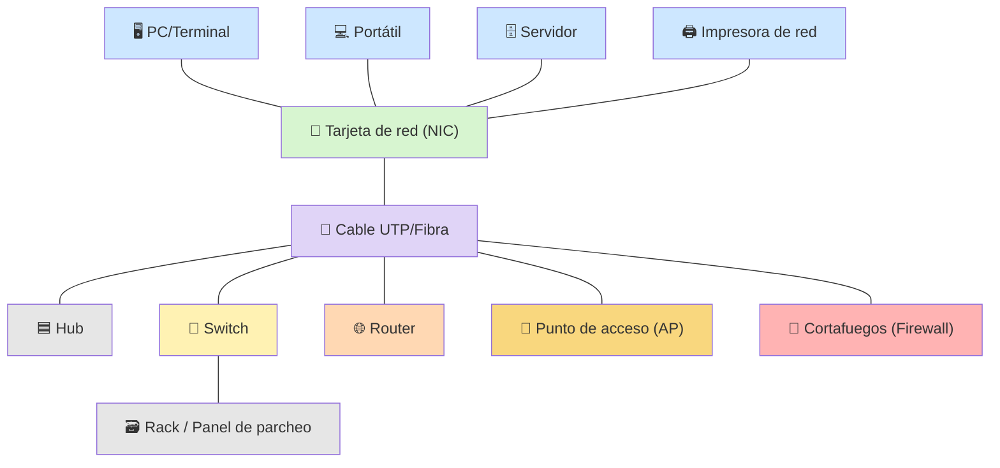
*Elementos físicos típicos de una red local: terminales (azul) conectados mediante su NIC y un medio de transmisión (morado) a los dispositivos de interconexión (hub, switch, router, AP, firewall), todo ello alojado habitualmente en un rack o armario de comunicaciones.*

> **Nota sobre Cisco Packet Tracer**: si vas a diseñar tus topologías con Packet Tracer, ten en cuenta que sus iconos de dispositivos (routers, switches, PCs, servidores...) son gráficos propios de Cisco protegidos por derechos de autor, por lo que aquí se representan con símbolos genéricos equivalentes. En Packet Tracer encontrarás estos mismos elementos organizados por categorías en la parte inferior izquierda: *Routers*, *Switches*, *Hubs*, *Wireless Devices*, *End Devices* y *WAN Emulation*, entre otras.

### Elementos lógicos (software)

- **Sistemas operativos de red**.
- **Protocolos de comunicación** (TCP/IP, Ethernet...).
- **Direccionamiento**: direcciones IP, máscaras de subred, direcciones MAC.
- **Servicios de red**: DNS, DHCP, servidores web, correo, archivos.
- **Aplicaciones cliente-servidor**.

### Elementos funcionales

Se refiere al papel que desempeña cada elemento dentro de la red (emisor, receptor, intermediario, servidor, cliente, repetidor de señal, etc.), es decir, la función que cumple independientemente de si es hardware o software.

---


## 6. Terminología y tipos de redes: LAN, MAN, WAN

*(CE-c: Se han reconocido los distintos tipos de red y sus topologías)*

Una **red de datos** es un conjunto de dispositivos (nodos) interconectados que comparten información y recursos mediante un medio de transmisión y un conjunto de reglas (protocolos).

Clasificación según su **extensión geográfica**:

- **LAN (Local Area Network)**: red de área local. Cubre una zona reducida (oficina, edificio, campus). Suele ser propiedad privada de la organización. Alta velocidad y bajo coste. Ejemplo: red de un instituto.
- **MAN (Metropolitan Area Network)**: red de área metropolitana. Cubre una ciudad o área metropolitana, interconectando varias LAN. Ejemplo: red municipal de una ciudad.
- **WAN (Wide Area Network)**: red de área extensa. Cubre grandes distancias geográficas (país, continente, mundo). Suele usar infraestructuras de terceros (operadoras de telecomunicaciones). Ejemplo: Internet.

Otras clasificaciones adicionales que suelen mencionarse:

- **PAN (Personal Area Network)**: red de área personal, muy pequeño alcance (Bluetooth, USB).
- **CAN (Campus Area Network)**: red de campus, interconecta varios edificios cercanos.
- **SAN (Storage Area Network)**: red de almacenamiento.

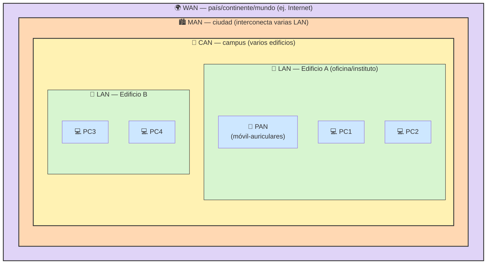
*Cada tipo de red "engloba" al anterior según su extensión geográfica: varias PAN forman una LAN, varias LAN de un campus forman una CAN, varias CAN/LAN de una ciudad forman una MAN, y el conjunto de redes a nivel mundial forma la WAN (Internet).*

### Otras clasificaciones de redes

- **Según la propiedad**: públicas (accesibles por cualquiera, ej. Internet) o privadas (uso restringido a una organización).
- **Según el medio de transmisión**: cableadas (guiadas) o inalámbricas (no guiadas).
- **Según la relación funcional**: redes cliente-servidor o redes entre iguales (peer to peer, P2P).
- **Según la titularidad de la gestión**: redes de acceso, redes troncales (backbone).

---

## 7. Topologías de red

*(CE-c: Se han reconocido los distintos tipos de red y sus topologías)*

La **topología** es la disposición física o lógica de los dispositivos y el cableado dentro de una red.

### 7.1 Topología en bus

Todos los dispositivos se conectan a un único cable central (bus) mediante el cual se transmite la información en ambas direcciones.
- Ventaja: sencilla y económica, poco cableado.
- Inconveniente: un fallo en el cable central puede dejar sin comunicación a toda la red; colisiones frecuentes.

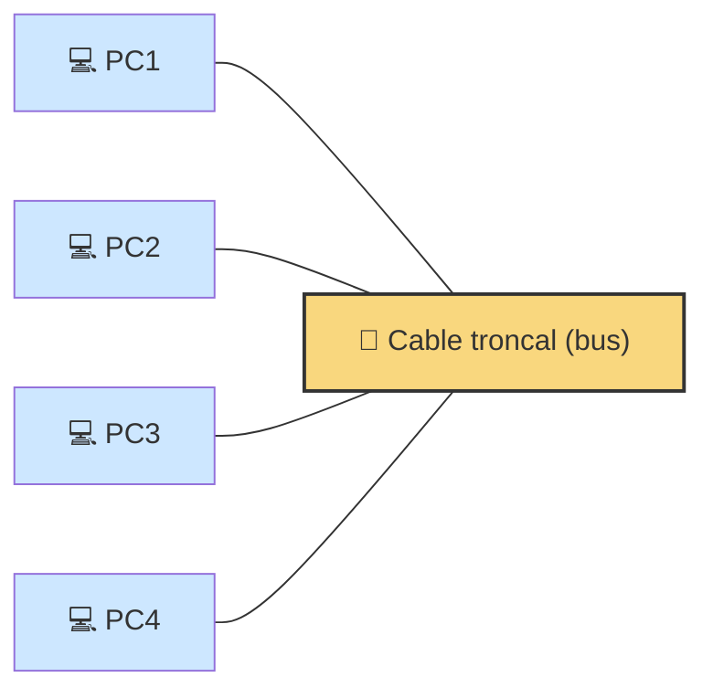
*Todos los equipos comparten el mismo cable central: si se corta el bus, se pierde la comunicación.*

### 7.2 Topología en anillo

Los dispositivos se conectan formando un círculo cerrado; la información viaja en un sentido (o en ambos, anillo doble) pasando de nodo en nodo.
- Ventaja: no hay colisiones si se usa paso de testigo (token).
- Inconveniente: el fallo de un nodo o del cable puede interrumpir toda la red (salvo con anillo doble redundante).

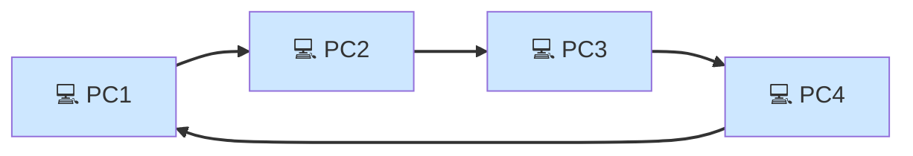
*Cada equipo pasa la información al siguiente formando un círculo; la información viaja siempre en el mismo sentido (flechas).*

### 7.3 Topología en estrella

Todos los dispositivos se conectan a un nodo central (switch o hub).
- Ventaja: fácil de gestionar y ampliar; el fallo de un equipo no afecta al resto.
- Inconveniente: si falla el nodo central, toda la red queda inoperativa. Es la topología física más usada actualmente en LAN.

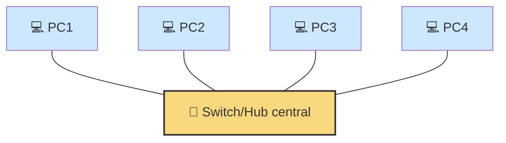
*Todos los equipos se conectan de forma independiente a un nodo central; si falla un cable solo afecta a ese equipo, pero si falla el switch, cae toda la red.*

### 7.4 Topología en árbol

Combinación jerárquica de varias topologías en estrella conectadas entre sí, con un nodo raíz del que parten ramas.
- Ventaja: escalable, organización jerárquica.
- Inconveniente: dependencia del nodo raíz o de los nodos superiores.

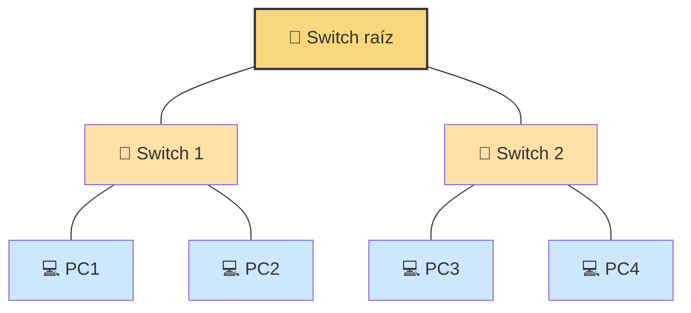
*Varias estrellas encadenadas jerárquicamente desde un switch raíz: fácil de escalar añadiendo nuevas ramas.*

### 7.5 Topología en malla

Cada dispositivo se conecta con varios (o todos) los demás dispositivos.
- **Malla completa**: todos conectados con todos → máxima redundancia y fiabilidad, pero coste y complejidad elevados.
- **Malla parcial**: solo algunos nodos tienen múltiples conexiones.
- Uso típico: redes troncales (backbone), WAN, Internet.

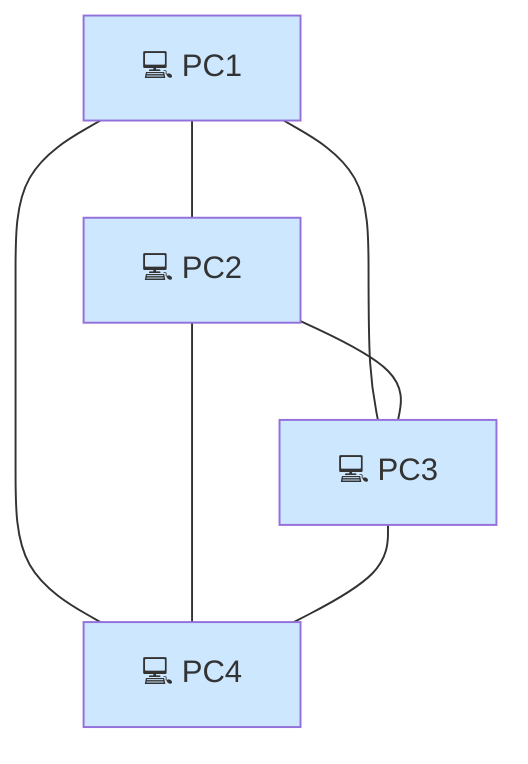
*Cada equipo tiene un enlace directo con todos los demás: máxima redundancia, pero requiere muchos cables (n·(n-1)/2 enlaces).*

### 7.6 Topología mixta/híbrida

Combinación de varias topologías anteriores según las necesidades de la organización. Es la más habitual en redes reales de tamaño medio-grande.

> **Topología física vs lógica**: la topología física es la disposición real del cableado; la topología lógica es el modo en que realmente viaja la información (p. ej., Ethernet es físicamente estrella pero lógicamente funciona como un bus compartido).

---

## 8. Arquitectura de redes y niveles

*(CE-d: Se han descrito las arquitecturas de red y los niveles que las componen.)*

Una **arquitectura de red** es un conjunto de niveles (capas) y protocolos que definen las reglas y estándares necesarios para que los dispositivos de una red se comuniquen entre sí de forma ordenada.

### ¿Por qué en niveles/capas?

- Divide un problema complejo (la comunicación) en partes más simples y manejables.
- Cada capa realiza una función concreta y ofrece servicios a la capa superior, apoyándose en los servicios de la capa inferior.
- Permite independencia entre capas: se puede modificar una capa sin afectar a las demás, siempre que se mantenga la interfaz.
- Facilita la interoperabilidad entre fabricantes distintos.
- Facilita el diseño, mantenimiento y estandarización.

Las arquitecturas de red más relevantes son el **modelo OSI** (de referencia, teórico) y el **modelo TCP/IP** (el realmente implementado en Internet).

---

## 9. Encapsulamiento de la información

Cuando los datos se transmiten a través de las distintas capas de la arquitectura de red, cada capa añade su propia información de control (cabecera, y a veces cola) al bloque de datos recibido de la capa superior. Este proceso se denomina **encapsulamiento**.

Proceso (de emisor a receptor):

1. La capa de **Aplicación** genera los datos.
2. La capa de **Transporte** añade una cabecera (p. ej. TCP/UDP) → forma un **segmento** (o datagrama en UDP).
3. La capa de **Red/Internet** añade su cabecera (IP) → forma un **paquete** (datagrama IP).
4. La capa de **Enlace** añade cabecera y cola (trama Ethernet) → forma una **trama**.
5. La capa **Física** convierte la trama en **bits** (señales eléctricas, ópticas o de radio) para su transmisión por el medio.

En el receptor se realiza el proceso inverso, llamado **desencapsulamiento**: cada capa retira su cabecera correspondiente y entrega el resto a la capa superior, hasta llegar a la aplicación.

```
Datos (Aplicación)
 └─ Segmento = Cabecera TCP/UDP + Datos (Transporte)
     └─ Paquete = Cabecera IP + Segmento (Red)
         └─ Trama = Cabecera Enlace + Paquete + Cola (Enlace)
             └─ Bits (Física)
```

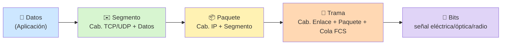
*Cada capa "empaqueta" los datos de la anterior dentro de un sobre nuevo, añadiendo su propia cabecera (y, en el enlace, también una cola de control de errores).*

---

## 10. El modelo OSI

El modelo **OSI (Open Systems Interconnection)** fue desarrollado por la ISO en 1984 como modelo de referencia teórico para la interconexión de sistemas abiertos. Define **7 capas o niveles**:

| Nº | Capa | Función principal | Unidad de datos (PDU) |
|---|---|---|---|
| 7 | Aplicación | Provee servicios directamente a las aplicaciones del usuario (correo, web, transferencia de archivos) | Datos |
| 6 | Presentación | Traduce, cifra y comprime los datos para que sean entendibles entre sistemas distintos | Datos |
| 5 | Sesión | Establece, mantiene y finaliza las sesiones de comunicación entre aplicaciones | Datos |
| 4 | Transporte | Comunicación extremo a extremo, control de flujo y errores, fiabilidad (TCP) o rapidez (UDP) | Segmento |
| 3 | Red | Direccionamiento lógico (IP) y encaminamiento (routing) entre redes distintas | Paquete |
| 2 | Enlace de datos | Direccionamiento físico (MAC), detección de errores, control de acceso al medio | Trama |
| 1 | Física | Transmisión de bits por el medio físico (voltajes, luz, ondas), características eléctricas y mecánicas | Bits |

**Regla mnemotécnica** (de arriba a abajo): "*A*ntes de *P*edir *S*iempre *T*ómate un *R*efresco de *E*naldo con *F*resas" → Aplicación, Presentación, Sesión, Transporte, Red, Enlace, Física.

Las capas 5-7 se orientan a la aplicación; las capas 1-4 se orientan al transporte de datos por la red.

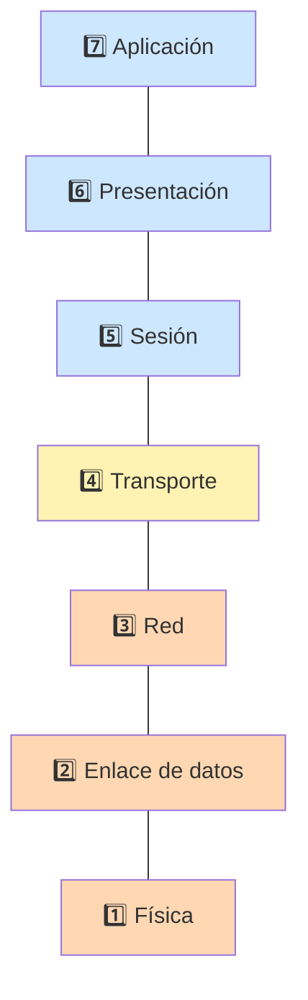
*Capas 5-7 (azul) orientadas a la aplicación · Capa 4 (amarillo) transición · Capas 1-3 (naranja) orientadas al transporte por la red.*

---

## 11. El modelo TCP/IP

El modelo **TCP/IP** es el que realmente se implementa en Internet. Es más práctico y tiene **4 capas** (algunos textos citan una versión de 5 capas separando enlace y física):

| Capa TCP/IP | Capas OSI equivalentes | Protocolos típicos |
|---|---|---|
| Aplicación | Aplicación + Presentación + Sesión | HTTP, HTTPS, FTP, SMTP, DNS, Telnet, SSH |
| Transporte | Transporte | TCP, UDP |
| Internet (Red) | Red | IP, ICMP, ARP |
| Acceso a la red (Enlace + Física) | Enlace + Física | Ethernet, Wi-Fi, PPP |

### Comparativa OSI vs TCP/IP

```
OSI                    TCP/IP
--------------------   ------------------
Aplicación   ─┐
Presentación  ├──────► Aplicación
Sesión       ─┘
Transporte    ───────► Transporte
Red           ───────► Internet
Enlace       ─┐
Física        ├──────► Acceso a la red
```

- El modelo OSI es **teórico/de referencia**, más detallado didácticamente.
- El modelo TCP/IP es **práctico**, el que realmente se usa en Internet.

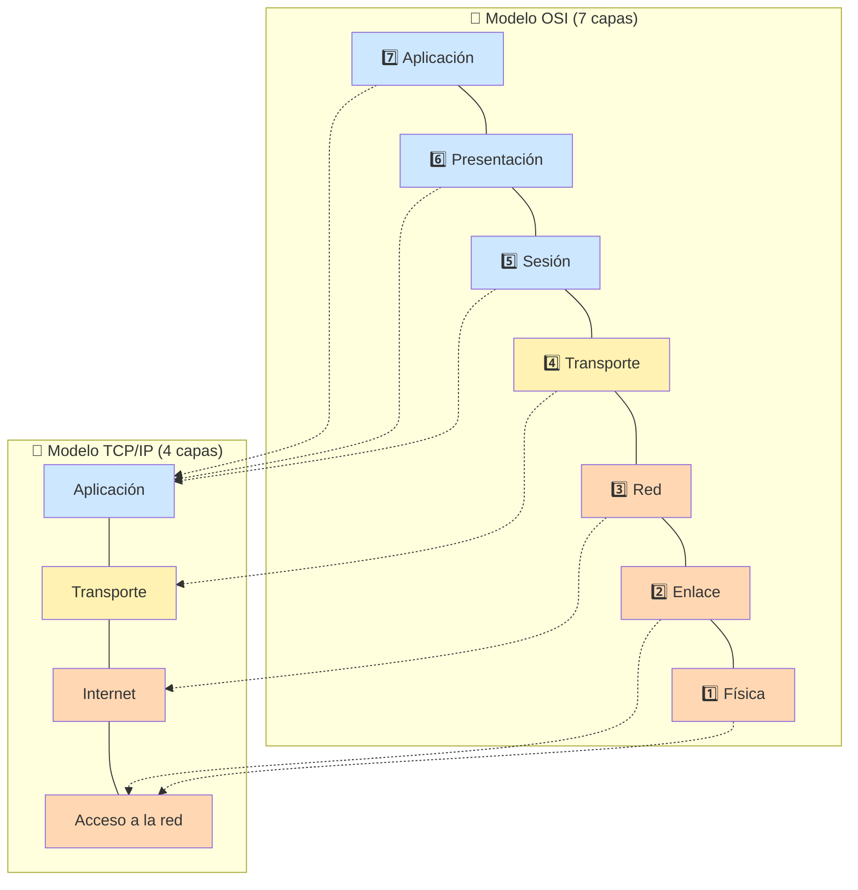
*Las líneas punteadas muestran qué capas de OSI equivalen a cada capa de TCP/IP: 3 capas de OSI (Aplicación+Presentación+Sesión) se agrupan en 1 sola capa de Aplicación en TCP/IP.*

---

## 12. Protocolos de comunicación

*(CE-e: Se ha descrito el concepto de protocolo de comunicación.)*

Un **protocolo de comunicación** es un conjunto de normas y reglas que permiten que dos o más dispositivos se comuniquen e intercambien información de manera correcta y ordenada. Define:

- El **formato** de los mensajes (sintaxis).
- El **significado** de cada campo del mensaje (semántica).
- El **orden y sincronización** de los intercambios de mensajes (temporización).

Es equivalente a un "idioma" común que deben compartir emisor y receptor para entenderse. Ejemplos: TCP, IP, HTTP, Ethernet, FTP, DNS.

---

## 13. Funcionamiento de las pilas de protocolos

*(CE-f Se ha descrito el funcionamiento de las pilas de protocolos en las distintas arquitecturas de red.)*

Una **pila de protocolos** (protocol stack) es el conjunto ordenado de protocolos que actúan en cada una de las capas de una arquitectura de red, cooperando entre sí para lograr la comunicación completa.

Funcionamiento general:

1. Cada capa de la pila del **emisor** usa su propio protocolo, añade su información de control (encapsulamiento) y pasa los datos a la capa inferior.
2. Los datos viajan por el medio físico hasta el **receptor**.
3. En el receptor, cada capa de la pila procesa (desencapsula) la información correspondiente a su nivel y la entrega a la capa superior.
4. Existe una **comunicación virtual (horizontal)** entre capas del mismo nivel en emisor y receptor (cada capa "habla" con su capa homóloga mediante su protocolo), aunque físicamente los datos bajan y suben por las capas (**comunicación real, vertical**).

Ejemplo con la pila TCP/IP: una petición web (HTTP) se apoya en TCP (transporte fiable), que se apoya en IP (encaminamiento), que se apoya en Ethernet (acceso al medio) para finalmente transmitirse como señales físicas.

---


## 14. Tecnologías Ethernet

*(Contenido: tecnologías Ethernet)*

**Ethernet** es la tecnología de red LAN más extendida, estandarizada por el IEEE en la familia de normas **802.3**. Define aspectos de la capa física y de la capa de enlace de datos.

### Evolución de velocidades

| Estándar | Nombre | Velocidad |
|---|---|---|
| 802.3 | Ethernet | 10 Mbps |
| 802.3u | Fast Ethernet | 100 Mbps |
| 802.3ab / 802.3z | Gigabit Ethernet | 1 Gbps |
| 802.3ae | 10 Gigabit Ethernet | 10 Gbps |
| 802.3ba | 40/100 Gigabit Ethernet | 40-100 Gbps |

### Características

- Usa el método de acceso al medio **CSMA/CD** (Carrier Sense Multiple Access with Collision Detection) en sus versiones originales con medio compartido (hoy en desuso en redes conmutadas con switches full-duplex, donde no hay colisiones).
- Direccionamiento mediante **direcciones MAC** (48 bits, hexadecimal).
- Trama Ethernet: contiene dirección MAC destino, MAC origen, tipo/longitud, datos y **FCS** (Frame Check Sequence) para detección de errores.

---

## 15. El modelo OSI y Ethernet

Ethernet se corresponde con las **dos capas inferiores** del modelo OSI:

- **Capa 2 (Enlace de datos)**: se subdivide a su vez en dos subcapas (definidas por IEEE 802):
  - **LLC (Logical Link Control, 802.2)**: control de enlace lógico, independiente de la tecnología física, gestiona el control de errores y flujo.
  - **MAC (Media Access Control)**: control de acceso al medio, gestiona el direccionamiento físico (MAC) y el acceso al medio compartido (CSMA/CD).
- **Capa 1 (Física)**: define las características eléctricas, ópticas, mecánicas y de señalización (tipos de cable, conectores, velocidades).

---

## 16. Tipos de cableado Ethernet

Denominación estándar: **[velocidad][tipo de señal][medio/longitud]**

| Denominación | Velocidad | Medio | Distancia máx. |
|---|---|---|---|
| 10BASE-T | 10 Mbps | Par trenzado (Cat3) | 100 m |
| 100BASE-TX | 100 Mbps | Par trenzado (Cat5) | 100 m |
| 1000BASE-T | 1 Gbps | Par trenzado (Cat5e/6) | 100 m |
| 10GBASE-T | 10 Gbps | Par trenzado (Cat6a/7) | 100 m |
| 100BASE-FX | 100 Mbps | Fibra óptica multimodo | ~2 km |
| 1000BASE-SX | 1 Gbps | Fibra óptica multimodo | ~550 m |
| 1000BASE-LX | 1 Gbps | Fibra óptica monomodo | ~5 km |
| 10GBASE-SR/LR | 10 Gbps | Fibra óptica multi/monomodo | 300 m / 10 km |

### Categorías de par trenzado (UTP)

| Categoría | Velocidad soportada | Uso |
|---|---|---|
| Cat3 | 10 Mbps | Obsoleto (telefonía, Ethernet antiguo) |
| Cat5 | 100 Mbps | Obsoleto |
| Cat5e | 1 Gbps | Muy extendido |
| Cat6 | 1-10 Gbps (distancia limitada) | Actual |
| Cat6a | 10 Gbps | Actual, mejor apantallamiento |
| Cat7/Cat8 | 10-40 Gbps | Alta gama, apantallado |

### Normas de conexión (pines RJ-45)

- **T568A** y **T568B**: normas de cableado que definen el orden de los hilos en el conector RJ-45.
- **Cable directo (straight-through)**: mismo estándar en ambos extremos (T568B-T568B); conecta dispositivos distintos (PC-switch).
- **Cable cruzado (crossover)**: T568A en un extremo y T568B en el otro; conecta dispositivos iguales (PC-PC, switch-switch), aunque hoy en día muchos equipos tienen **Auto-MDIX** y detectan automáticamente el tipo de cable.

**Conector RJ-45 (8P8C):**


*Conector RJ-45 (8P8C) transparente sin engarzar, donde se aprecian los 8 pines metálicos numerados que siguen el orden T568A/T568B. Fuente: Wikimedia Commons (CC).*

---

## 17. Tipos de cableado de fibra óptica

La **fibra óptica** transmite información en forma de pulsos de luz a través de un núcleo de vidrio o plástico.

### Estructura de la fibra

- **Núcleo**: por donde viaja la luz.
- **Revestimiento (cladding)**: refleja la luz manteniéndola dentro del núcleo.
- **Cubierta/recubrimiento**: protección física.

### Tipos según el modo de propagación

- **Fibra multimodo (MMF)**: núcleo de mayor diámetro (50-62,5 micras), permite múltiples modos (rayos) de luz. Usa LEDs o láseres de bajo coste. Menor distancia (hasta ~2 km) y menor coste. Uso típico en redes LAN/campus.
- **Fibra monomodo (SMF)**: núcleo muy estrecho (~9 micras), un único modo de propagación. Usa láser. Mayor distancia (decenas de km) y ancho de banda, pero mayor coste. Uso típico en redes troncales/WAN y largas distancias.

### Conectores de fibra más comunes

- **SC (Subscriber Connector)**: conector cuadrado, encaja a presión.
- **LC (Lucent Connector)**: más pequeño, muy usado actualmente en switches/routers.
- **ST (Straight Tip)**: conector de tipo bayoneta, más antiguo.
- **FC (Ferrule Connector)**: conector roscado, usado en entornos de alta vibración.

**Comparativa visual de conectores de fibra óptica:**


*ST (izquierda) y SC (derecha). Fuente: Wikimedia Commons (CC BY-SA)*


*LC (izquierda) y SC (derecha). Fuente: Wikimedia Commons (Poil, CC BY-SA)*

### Ventajas de la fibra frente al cobre

- Inmunidad total a interferencias electromagnéticas.
- Mayor ancho de banda y velocidad.
- Mayor distancia de transmisión sin repetidores.
- Mayor seguridad (más difícil de "pinchar").
- Sin riesgo eléctrico (no conduce electricidad).

---

## 18. Dispositivos de interconexión de redes

*(CE-h: dispositivos de interconexión según el nivel funcional)*

Los dispositivos de interconexión se clasifican según la capa del modelo OSI en la que operan:

| Dispositivo | Capa OSI | Función |
|---|---|---|
| **Repetidor** | 1 (Física) | Regenera y amplifica la señal para alargar el alcance del medio. |
| **Hub / Concentrador** | 1 (Física) | Repetidor multipuerto; reenvía la señal a todos los puertos por igual (crea un único dominio de colisión). En desuso. |
| **Puente (Bridge)** | 2 (Enlace) | Divide una red en segmentos, filtrando el tráfico según direcciones MAC; crea dominios de colisión separados. |
| **Switch (Conmutador)** | 2 (Enlace) | Puente multipuerto; aprende las direcciones MAC de cada puerto y envía las tramas solo al destino correspondiente. Cada puerto es un dominio de colisión independiente. |
| **Router (Encaminador)** | 3 (Red) | Interconecta redes distintas (con distinto direccionamiento IP); decide la mejor ruta (encaminamiento) basándose en direcciones IP; separa dominios de difusión (broadcast). |
| **Punto de acceso (AP)** | 1-2 | Permite la conexión de dispositivos inalámbricos a una red cableada. |
| **Pasarela (Gateway)** | Hasta capa 7 | Convierte protocolos distintos entre dos redes que usan arquitecturas diferentes (p. ej. entre una red y un sistema de correo distinto). |
| **Cortafuegos (Firewall)** | 3-7 | Filtra el tráfico según reglas de seguridad, puede operar a distintos niveles. |

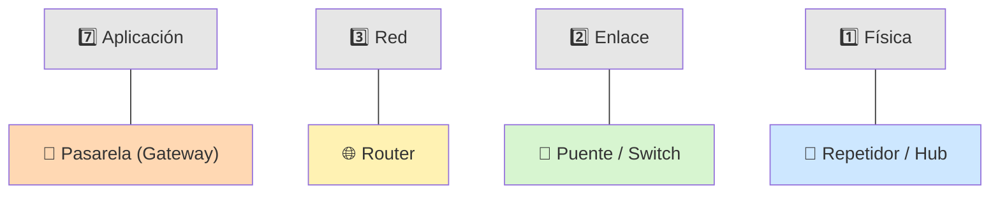
*Cuanto más "arriba" opera un dispositivo, más "inteligente" y capaz de tomar decisiones es (y más lento/costoso suele ser): repetidor (solo amplifica bits) → switch (decide por MAC) → router (decide por IP) → gateway (traduce protocolos completos).*

### El punto de acceso (Access Point, AP)

El **punto de acceso inalámbrico (AP)** es el dispositivo que permite a los equipos con tarjeta de red Wi-Fi (portátiles, móviles, tablets) conectarse a una red cableada existente, actuando de "puente" entre el medio inalámbrico (radiofrecuencia) y el medio cableado (Ethernet).

- Opera principalmente en las **capas 1 y 2** del modelo OSI: convierte las tramas que recibe por el aire (802.11 Wi-Fi) en tramas Ethernet (802.3) que envía al switch/router de la red cableada, y viceversa.
- Se comporta de forma similar a un switch/hub inalámbrico: todos los dispositivos conectados al mismo AP comparten el mismo medio radioeléctrico (el mismo canal), por lo que forman un único dominio de colisión inalámbrico (gestionado mediante CSMA/CA en lugar de CSMA/CD).
- Suele conectarse mediante cable UTP a un switch o router de la red LAN, y desde ahí obtiene el acceso a los demás recursos de la red (Internet, servidores...).
- Es habitual que routers domésticos incluyan un AP integrado, aunque en redes profesionales suelen ser dispositivos independientes gestionados de forma centralizada (varios AP con el mismo SSID para dar cobertura a distintas zonas, "roaming").
- Puede funcionar en varios modos: **modo infraestructura** (el más común, el AP centraliza las comunicaciones) o **modo ad-hoc/punto a punto** (comunicación directa entre dispositivos sin AP).

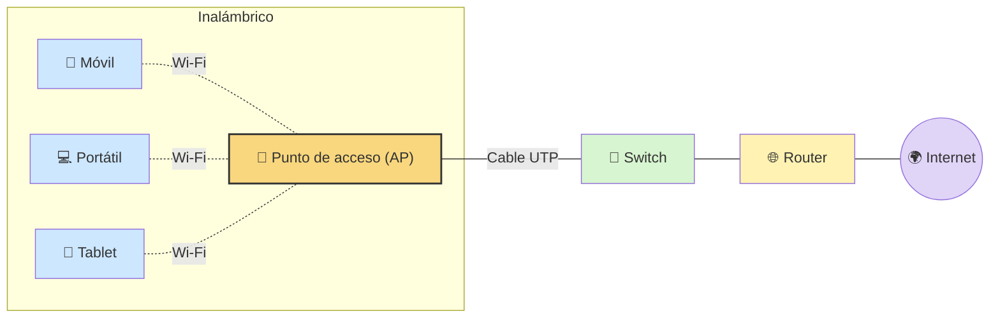
*El AP hace de puente entre el medio inalámbrico (líneas discontinuas) y el medio cableado (líneas continuas), integrando los dispositivos Wi-Fi en la misma red LAN.*

### Dominios de colisión y de difusión

- **Dominio de colisión**: conjunto de dispositivos que comparten el medio y pueden generar colisiones entre sí (hub → un único dominio; switch → un dominio por puerto).
- **Dominio de difusión (broadcast)**: conjunto de dispositivos que reciben los mensajes de difusión (broadcast) de los demás (solo se separa mediante routers, o mediante VLAN en switches).

---

## 19. El modelo cliente-servidor

*(CE-i Se ha descrito el concepto de cliente-servidor.)*

El modelo **cliente-servidor** es un modelo de arquitectura de aplicaciones en red en el que se distinguen dos roles:

- **Servidor**: proceso o equipo que ofrece un servicio o recurso (ej. páginas web, archivos, correo, base de datos) y permanece a la espera de peticiones ("escuchando" en un puerto determinado).
- **Cliente**: proceso o equipo que solicita el servicio al servidor y espera su respuesta.

### Características

- El servidor puede atender a múltiples clientes simultáneamente.
- La comunicación se inicia siempre por parte del cliente (petición) y el servidor responde.
- Suele requerir de un servidor con más capacidad de proceso, almacenamiento y disponibilidad (a menudo funcionando 24/7).
- Ejemplos: navegador web (cliente) - servidor web (Apache, Nginx, IIS); cliente de correo - servidor de correo (SMTP/POP3/IMAP); cliente FTP - servidor FTP.

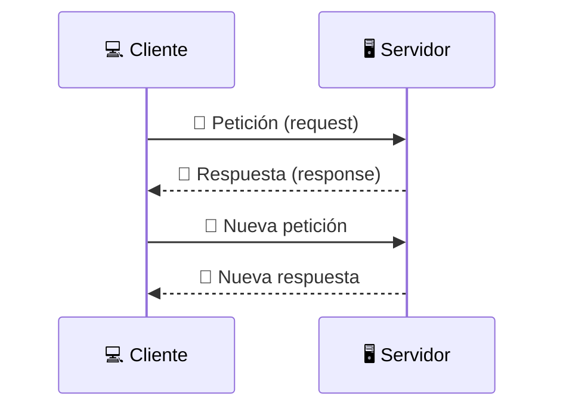
*El cliente siempre inicia la comunicación (petición) y el servidor permanece a la espera, respondiendo a cada solicitud.*

### Cliente-servidor frente a P2P (Peer to Peer)

En una red **P2P**, cada equipo puede actuar simultáneamente como cliente y como servidor, sin distinción de roles fijos, compartiendo recursos directamente entre iguales (ej. redes de intercambio de archivos, algunas aplicaciones de videoconferencia).

---

## 20. Organismos de estandarización

*(CE-j: Se han reconocido los organismos internacionales responsables de desarrollar las características técnicas de los elementos físicos y lógicos en una infraestructura de red)*

La existencia de estándares comunes permite la interoperabilidad entre fabricantes distintos. Los principales organismos son:

- **[ISO](https://www.iso.org/) (International Organization for Standardization)**: organización internacional de normalización; desarrolló el modelo de referencia OSI.
- **[IEEE](https://www.ieee.org/) (Institute of Electrical and Electronics Engineers)**: instituto de ingenieros eléctricos y electrónicos; responsable de estándares de redes LAN, como la familia **802** (802.3 Ethernet, 802.11 Wi-Fi, 802.15 Bluetooth, 802.1Q VLAN, etc.).
- **[IETF](https://www.ietf.org/) (Internet Engineering Task Force)**: grupo de trabajo de ingeniería de Internet; desarrolla los estándares de Internet mediante documentos **RFC** (Request For Comments), responsable de protocolos TCP/IP.
- **[ITU-T](https://www.itu.int/en/ITU-T/Pages/default.aspx) (International Telecommunication Union - Telecommunication Standardization Sector)**: sector de normalización de telecomunicaciones de la ONU; estándares de telecomunicaciones (ej. RDSI, xDSL).
- **[ANSI](https://www.ansi.org/) (American National Standards Institute)**: instituto de normalización de EE. UU.
- **[EIA/TIA](https://tiaonline.org/) (Electronic Industries Alliance / Telecommunications Industry Association)**: definen estándares de cableado estructurado (ej. norma **TIA/EIA-568** para cableado UTP, T568A/T568B).
- **[ICANN](https://www.icann.org/) (Internet Corporation for Assigned Names and Numbers)**: gestiona la asignación de nombres de dominio y direcciones IP a nivel mundial.
- **[W3C](https://www.w3.org/) (World Wide Web Consortium)**: estándares relacionados con la web (HTML, CSS, XML...).

---

## Resumen de conceptos clave

- Las redes evolucionan por el aumento de datos, movilidad, nuevos servicios y estandarización.
- Los sistemas de numeración binario y hexadecimal son fundamentales para interpretar direccionamiento IP y MAC.
- LAN, MAN y WAN se diferencian por su extensión geográfica.
- La topología (bus, anillo, estrella, árbol, malla) define la disposición física/lógica de la red.
- Los medios de transmisión pueden ser guiados (cobre, fibra) o no guiados (inalámbricos).
- Las arquitecturas en capas (OSI de 7 capas, TCP/IP de 4 capas) organizan la comunicación en red y permiten el encapsulamiento de datos.
- Un protocolo define las reglas de comunicación; una pila de protocolos las combina por capas.
- Ethernet (IEEE 802.3) es la tecnología LAN dominante, con múltiples tipos de cableado de cobre y fibra.
- Los dispositivos de interconexión (repetidor, hub, switch, router...) se diferencian según el nivel OSI en que trabajan.
- El modelo cliente-servidor organiza la comunicación entre quien ofrece y quien solicita un servicio.
- Organismos como ISO, IEEE, IETF y TIA/EIA garantizan la estandarización de las redes.
